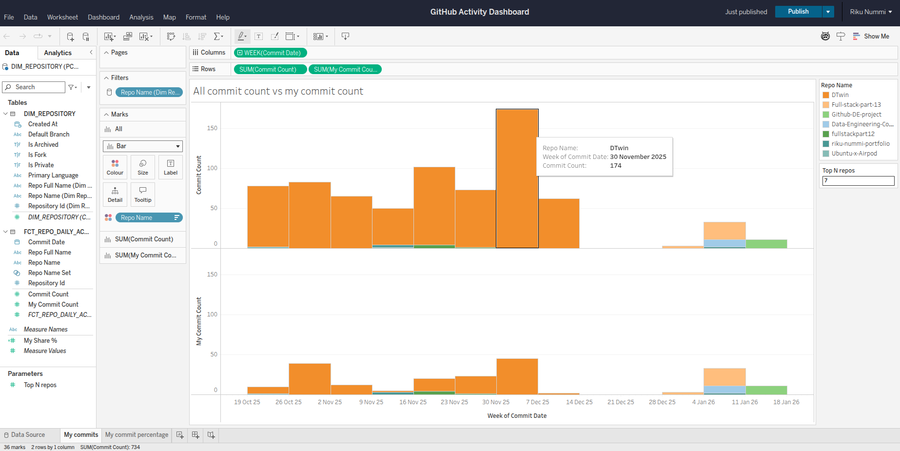
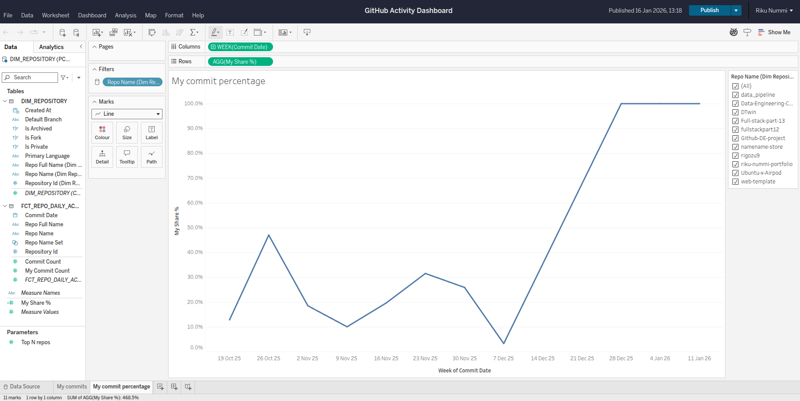

# GitHub ELT Pipeline (Fivetran → Snowflake → dbt → Tableau)

This project demonstrates a full ELT pipeline that ingests GitHub activity data into Snowflake, transforms it with dbt into analytics-ready models, and visualizes the results in Tableau.

## Start up instructions
1. docker compose up init-airflow

2. docker compose up

3. sign in to airflow

4. Lorem ipsum 2
## Architecture

**GitHub → Fivetran → Snowflake → dbt → Tableau**

1. **GitHub (Source)**
   - GitHub data (repositories, commits, etc.) is the source system.

2. **Fivetran (Extract + Load)**
   - Fivetran connects to GitHub and syncs the raw data into Snowflake on a schedule.
   - The output is a raw schema/tables in Snowflake that mirror the source.

3. **Snowflake (Warehouse)**
   - Snowflake stores both:
     - **Raw** data loaded by Fivetran
     - **Analytics models** built by dbt (staging/intermediate/marts)

4. **dbt (Transform)**
   - dbt transforms the raw GitHub tables into clean, documented, analytics-ready models.
   - Typical modeling layers:
     - **stg_***: renamed/typed columns, basic cleanup
     - **int_***: joins and intermediate logic
     - **fct_*** / **dim_***: fact/dimension tables for BI

5. **Tableau (BI / Visualization)**
   - Tableau connects directly to Snowflake (Live connection) and queries the dbt models.
   - Dashboards focus on commit activity and “my commits vs all commits” style metrics.

---

## What the dashboard shows

### Commit count vs my commit count
A weekly view comparing overall commits to commits authored by me, useful for understanding contribution trends across repositories.

### My share of commits (%)
A weekly “share” metric that shows what percentage of commits were mine, per selected repo(s).

---